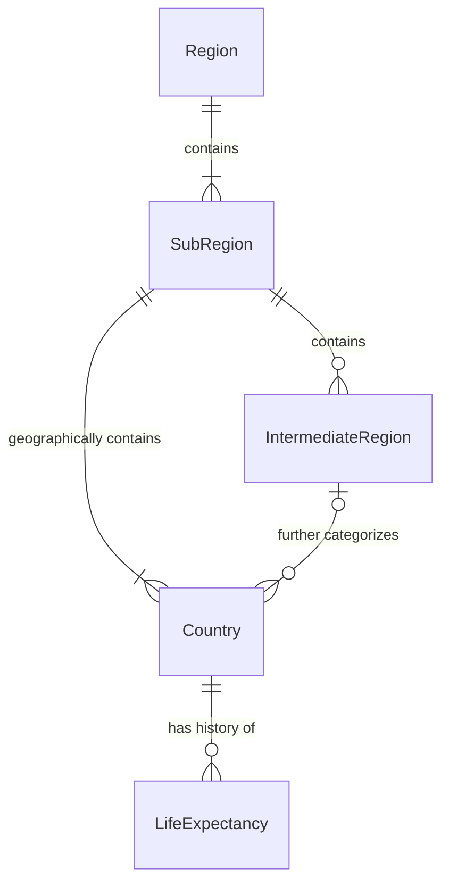

# Life Expectancy Dashboard

A comprehensive web application for analyzing and visualizing Life Expectancy at Birth data across different countries, regions, and time periods. Built with Express.js, HTMX, Handlebars, and MySQL, this dashboard provides powerful insights into global health trends and demographic patterns.

---

## 📋 Table of Contents

- [Introduction](#-introduction)
- [Data Sources](#-data-sources)
- [Features](#-features)
- [Database Design](#-database-design)
- [Technology Stack](#-technology-stack)
- [Quick Start](#-quick-start)
- [Project Structure](#-project-structure)
- [Documentation](#-documentation)
- [License](#-license)

---

## 🌍 Introduction

Life Expectancy at Birth is arguably the most fundamental and widely used demographic indicator for comparative analysis of a society's overall health, development, and quality of life. This metric represents the average number of years a newborn infant is expected to live if prevailing age-specific mortality rates remain constant throughout their life.

### Why Life Expectancy Matters

- **Benchmarking Health System Performance:** Directly reflects the success of healthcare systems in preventing premature deaths and managing chronic conditions
- **Highlighting Socioeconomic Development:** Sensitive to improvements in nutrition, sanitation, education, and income levels
- **Revealing Health Inequalities:** Exposes systemic vulnerabilities and guides targeted public health interventions
- **Informing Policy and Planning:** Helps governments forecast demands on national resources and plan for aging populations

This dashboard enables researchers, policymakers, and analysts to explore these patterns through interactive visualizations and data queries.

> 📖 **Learn more:** See [docs/EXAM.md](docs/EXAM.md) for detailed background and project requirements.

---

## 📊 Data Sources

This project utilizes two primary datasets:

### 1. Life Expectancy Facts (`data1.csv`)

- **Entity:** Political Entity name
- **Code:** ISO 3166-1 alpha-3 code (e.g., AFG, USA)
- **Year:** Year of the data record
- **LifeExpectancy:** Period life expectancy in years at birth

### 2. Geographic Metadata (`data2.csv`)

- Country names and ISO codes (alpha-2, alpha-3, numeric)
- Geographic hierarchy: Region → Sub-Region → Intermediate Region
- ISO region codes for standardized categorization

### Data Origin

- Primary source: [Our World in Data](https://ourworldindata.org/)
- Secondary source: [Kaggle - Country Mapping Dataset](https://www.kaggle.com/datasets/andradaolteanu/country-mapping-iso-continent-region)

> 📖 **Learn more:** See [docs/EXAM.md](docs/EXAM.md#the-data) for complete data specifications and ETL process.

---

## ✨ Features

The dashboard provides **8 core features** for comprehensive data analysis:

### 1. 📈 Historical Trends Per Country

Select a country to view its Life Expectancy at Birth trends over time, ordered chronologically.

### 2. 🌏 Sub-Region Comparative Snapshot

Compare all countries within a sub-region for a specific year, revealing regional disparities.

### 3. 🔍 Regional "Weakest Link" Analysis

Identify sub-regions with the lowest life expectancy within a selected region and year.

### 4. 🔎 Keyword Search & Peak Performance

Search countries by name and discover their maximum recorded life expectancy.

### 5. ➕ Smart Insert (Next Year Projection)

Add new life expectancy records for the next available year for any country.

### 6. ✏️ Precision Data Correction

Update existing life expectancy records for specific country-year combinations.

### 7. 🗑️ Bulk Deletion by Range

Delete life expectancy records for a country within a specified year range.

### 8. 📊 Custom Feature: The "Inequality Gap"

Analyze the disparity between the highest and lowest life expectancies within a region, measuring health equity.

> 📖 **Learn more:** See [docs/FEATURES.md](docs/FEATURES.md) for detailed implementation specifications, endpoints, and SQL queries.

---

## 🗄️ Database Design

The database follows a **normalized 3NF (Third Normal Form)** schema with 5 core entities:



### Entity Overview

- **Region:** Top-level continents (Africa, Europe, etc.)
- **SubRegion:** Geographic subdivisions (Northern Africa, Western Europe, etc.)
- **IntermediateRegion:** Granular statistical areas (optional)
- **Country:** Primary political entities with ISO codes
- **LifeExpectancy:** Time-series fact table (country + year + value)

### Normalization Benefits

- ✅ **1NF:** Atomic values, no repeating groups
- ✅ **2NF:** No partial dependencies on composite keys
- ✅ **3NF:** No transitive dependencies (e.g., Country → SubRegion → Region)

> 📖 **Learn more:** See [docs/ERD.md](docs/ERD.md) for complete ER diagram, normalization proof, and design philosophy.

---

## 🛠️ Technology Stack

### Backend

- **Node.js** (v14+) - Runtime environment
- **Express.js** (v4.18) - Web application framework
- **MySQL** (v8.0) - Relational database

### Frontend

- **Handlebars** (v7.1) - Server-side templating
- **HTMX** - Dynamic HTML updates without JavaScript
- **Bootstrap 5** - Responsive UI framework

### DevOps

- **Docker & Docker Compose** - Containerization
- **Winston** - Application logging
- **nodemon** - Development hot-reload

---

## 🚀 Quick Start

### Prerequisites

- [Docker](https://www.docker.com/get-started) (v20.10+)
- [Docker Compose](https://docs.docker.com/compose/) (v2.0+)
- [Git](https://git-scm.com/)

### Installation & Deployment

1. **Clone the repository**

   ```bash
   git clone https://github.com/yourusername/life-exp-dashboard.git
   cd life-exp-dashboard
   ```

2. **Configure environment variables** (optional)

   ```bash
   cp .env.example .env
   # Edit .env if you need to change default ports or credentials
   ```

3. **Start the application**

   ```bash
   docker compose up
   ```

   This command will:

   - Build the Node.js application container
   - Pull and configure MySQL 8.0 container
   - Initialize the database with schema and data (via `init.sql`)
   - Start the web server on port 3000 (default)

4. **Access the dashboard**
   ```
   http://localhost:3000
   ```

### Stopping the Application

```bash
# Stop and remove containers (preserves data volumes)
docker compose down

# Stop and remove containers + volumes (deletes database data)
docker compose down -v
```

### Troubleshooting

- **Port conflicts:** Modify `PORT` in `.env` file (default: 3000)
- **Database connection issues:** Wait 30-60 seconds for MySQL to initialize on first run
- **Logs:** Check `./logs/` directory or run `docker compose logs -f`

---

## 📁 Project Structure

```
life-exp-dashboard/
├── database/
│   ├── init.sql              # Database schema & ETL scripts
│   └── raw_data/             # CSV data files (data1.csv, data2.csv)
├── docs/
│   ├── EXAM.md               # Project requirements & background
│   ├── FEATURES.md           # Feature specifications & endpoints
│   └── ERD.md                # Database design & normalization
├── public/
│   ├── css/custom.css        # Custom styles
│   └── js/app.js             # Client-side scripts
├── src/
│   ├── app.js                # Express app configuration
│   ├── server.js             # Application entry point
│   ├── config/               # Database & logger configs
│   ├── middleware/           # Error handling & 404 middleware
│   ├── routes/               # API & page routes
│   ├── utils/                # Database helpers & validators
│   └── views/                # Handlebars templates
├── docker-compose.yaml       # Multi-container orchestration
├── Dockerfile                # Node.js app container definition
├── package.json              # Node.js dependencies
└── README.md                 # This file
```

---

## 📚 Documentation

Comprehensive documentation is available in the `docs/` directory:

- **[EXAM.md](docs/EXAM.md)** - Project requirements, data specifications, and evaluation criteria
- **[FEATURES.md](docs/FEATURES.md)** - Detailed feature implementations with SQL queries and endpoints
- **[ERD.md](docs/ERD.md)** - Database schema, ER diagram, and normalization strategy

---

## 🎓 Academic Context

This project was developed as the final exam for **Software Engineering in Construction Information Systems (CT5805701)**, Fall 2025, at National Taiwan University of Science and Technology (NTUST).

**Course Objectives Demonstrated:**

- ✅ Database design with 1NF, 2NF, and 3NF normalization
- ✅ ETL processes using SQL statements
- ✅ Dockerized development environment
- ✅ Three-tier web application (HTML/CSS + Express + MySQL)
- ✅ Modern web technologies (HTMX for dynamic updates)
- ✅ Git version control with meaningful commits
