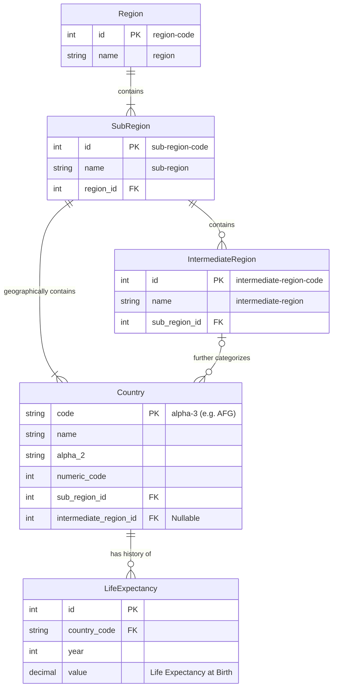

# Database Design & Normalization Strategy

## 1. Design Philosophy

The database is designed to store demographic time-series data while strictly adhering to the **3rd Normal Form (3NF)**. The core objective was to decompose the geographical hierarchy found in the source ISO standards (`Region` -> `SubRegion` -> `IntermediateRegion`) to eliminate redundancy and data modification anomalies.

## 2. Entity Explanations

The schema consists of **5 distinct entities**, ensuring granular control over geographical definitions and separating static metadata from dynamic fact data.

### A. Geographical Hierarchy (Dimensions)

These tables store static data. Changes here (e.g., a region renaming) propagate automatically to all associated countries without needing to update thousands of rows.

1.  **`Region`**

    - **Description:** The top-level continent (e.g., Africa, Europe).
    - **PK:** `id` (Derived from the integer `region-code`).
    - **Attributes:** `name`.

2.  **`SubRegion`**

    - **Description:** A geographical subdivision (e.g., Northern Africa, Western Europe).
    - **PK:** `id` (Derived from `sub-region-code`).
    - **FK:** `region_id` (Links to `Region`).

3.  **`IntermediateRegion`**
    - **Description:** A granular subdivision used for specific statistical areas.
    - **PK:** `id` (Derived from `intermediate-region-code`).
    - **FK:** `sub_region_id` (Links to `SubRegion`).
    - **Note:** Not all sub-regions have intermediate divisions. This table exists to capture this nuance without forcing it on all records.

### B. Political Entity (Dimension)

4.  **`Country`**
    - **Description:** The primary political entity (e.g., Afghanistan, Albania).
    - **PK:** `code` (The ISO 3166-1 alpha-3 code, e.g., "AFG").
    - **Relationships:**
      - **Mandatory:** Links to `SubRegion` (Every country belongs to a sub-region).
      - **Optional:** Links to `IntermediateRegion` (Nullable, as some countries like "Åland Islands" do not fall into an intermediate category in the source dataset).

### C. The Fact Table

5.  **`LifeExpectancy`**
    - **Description:** The transactional time-series data.
    - **PK:** `id` (Auto-incrementing integer).
    - **Composite Uniqueness:** A unique constraint on `(country_code, year)` ensures no duplicate data points exist for the same timeline.
    - **FK:** Links to `Country`.

## 3. Relationships and Cardinality

- **Region ||--|{ SubRegion (One-to-Many):** A Region contains multiple SubRegions, but a SubRegion belongs to only one Region.
- **SubRegion ||--o{ IntermediateRegion (One-to-Many, Optional):** A SubRegion may contain multiple Intermediate Regions.
- **SubRegion ||--|{ Country (One-to-Many):** A Country falls directly under a SubRegion.
- **IntermediateRegion |o--o{ Country (One-to-Many, Nullable):** A Country _may_ belong to an Intermediate Region. This relationship is "Zero or One" on the Country side regarding assignment, handling data sparsity gracefully.
- **Country ||--o{ LifeExpectancy (One-to-Many):** A single Country has many historical Life Expectancy records (one per year).

## 4. Normalization Strategy (Proof of 3NF)

To ensure high scores and data integrity, the design addresses the three forms of normalization:

### 1st Normal Form (1NF)

- **Requirement:** Atomicity.
- **Implementation:** All columns contain atomic values. There are no repeating groups or comma-separated lists (e.g., we do not store "1950: 28.1, 1951: 28.5" in a single cell).

### 2nd Normal Form (2NF)

- **Requirement:** Elimination of Partial Dependencies.
- **Implementation:** In the original `data1.csv`, `LifeExpectancy` depended on the composite of `Country` + `Year`. However, fields like `Region` or `Country Name` only depended on `Country`, not `Year`.
- **Solution:** We separated the `Country` entity from the `LifeExpectancy` entity. The `LifeExpectancy` table now strictly contains data dependent on the specific _instance_ of (Country + Year).

### 3rd Normal Form (3NF)

- **Requirement:** Elimination of Transitive Dependencies (non-key attributes dependent on other non-key attributes).
- **The Problem:** In a flat file, `Country` implies `SubRegion`, and `SubRegion` implies `Region`.
  - _Dependency:_ `Country` -> `SubRegion` -> `Region`.
- **The Solution:** We removed `Region` and `SubRegion` columns from the `Country` table.
  - To find a country's region, we must traverse the relationship: `Country` table -> `SubRegion` table -> `Region` table.
  - This ensures that if a SubRegion is renamed, it is updated in exactly one place (the `SubRegion` table), preventing data inconsistencies.
